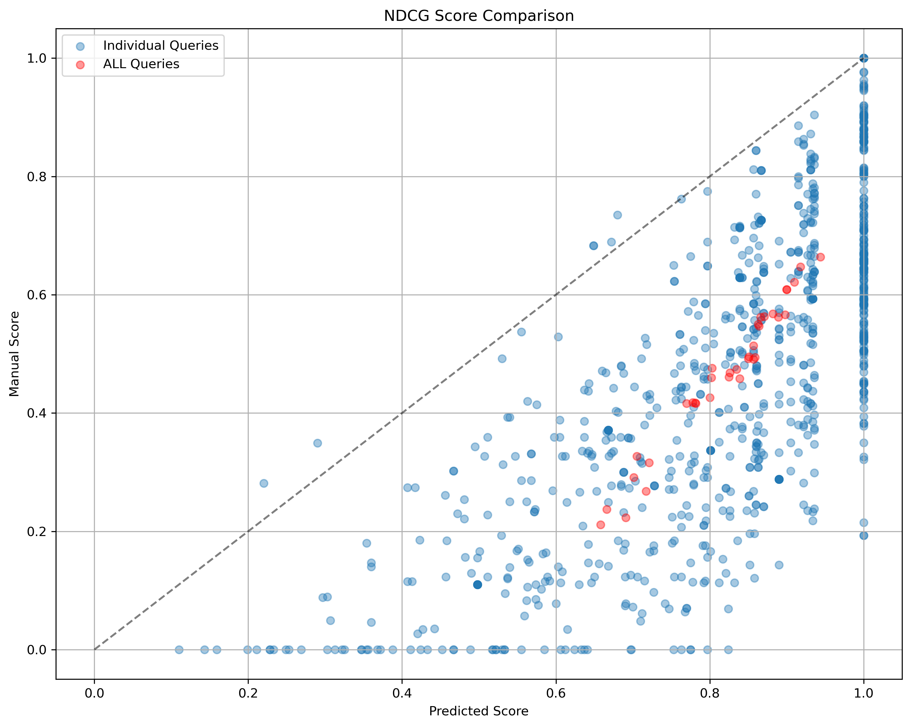

# Online Appendix for "Criteria-based LLM Relevance Judgments"


### Approach Architecture

*Figure 3: Overview of our criteria-based relevance judgment approach. The method evaluates each query-passage pair across four predefined criteria (Exactness, Topicality, Coverage, and Contextual Fit) before aggregating these scores into a final relevance judgment.*
## Prompts

Criteria-specific Grading System Message:

```text 
Please assess how well the provided passage meets specific criteria in relation to the query. Use the
following scoring scale (0-3) for evaluation:
0: Not relevant at all / No information provided.
1: Marginally relevant / Partially addresses the criterion.
2: Fairly relevant / Adequately addresses the criterion.
3: Highly relevant / Fully satisfies the criterion.
```


Criteria-specific Grading Prompt:
```text
Please rate how well the given passage meets the {criterion name} criterion in relation to the query. The output should be a single score (0-3) indicating {criterion definition}.

Query: [query]
Passage: [passage]
Score:
```

Aggregation System Message:
```text
You are a search quality rater evaluating the relevance of passages. Given a query and passage, you must provide a score on an integer scale of 0 to 3 with the following meanings:

3 = Perfectly relevant: The passage is dedicated to the query and contains the exact answer.
2 = Highly relevant: The passage has some answer for the query, but the answer may be a bit unclear, or hidden amongst extraneous information.
1 = Related: The passage seems related to the query but does not answer it.
0 = Irrelevant: The passage has nothing to do with the query

Assume that you are writing an answer to the query. If the passage seems to be related to the query but does not include any answer to the query, mark it 1. If you would use any of the information contained in the passage in such an asnwer, mark it 2. If the passage is primarily about the query, or contains vital information about the topic, mark it 3. Otherwise, mark it 0.
```


Aggregation Prompt:

The final relevance judgment combines individual criteria scores using this aggregation prompt:

```text
Please rate how the given passage is relevant to the query based on the given scores. 
The output must be only a score (0-3) that indicates how relevant they are.

Query: [query]
Passage: [passage]
Exactness: [score]
Topicality: [score]
Coverage: [score]
Contextual Fit: [score]
Score:
```
## Code

Source Code (src/)

- File Structure:
  - src/
    - main.py: Entry point and argument processing
    - relevance_scoring.py: Core 4-prompts implementation
    - model_utils.py: Model configuration utilities
    - relevance_processors.py: Evaluation processing logic
  - data/
  - results/


Basic Usage:

An example on how to evaluate passages using our criteria-based method:
```bash
python src/main.py \
  --model_id "google/flan-t5-large" \
  --test_qrel_path "./data/dl2020/2020qrels-pass.txt" \
  --queries_path "./data/dl2020/msmarco-test2020-queries.tsv" \
  --docs_path "./data/dl2020/dl2020_document.jsonl" \
  --result_file_path "./results/dl2020_4prompts.txt" \
  --max_query 1 \
  --max_doc 1 \
  -decomposed_relavance \
```

For Together AI API usage:

```bash
# Set API key
export TOGETHER_API_KEY=your_api_key

# Run evaluation
python main.py [same arguments as above] -together
```


#### Language Models
- **google/flan-t5-large**
- **meta-llama/Meta-Llama-3-8B-Instruct** 
- **meta-llama/Llama-3.3-70B-Instruct-Turbo** (via Together AI)

## Experimental Results

### System Performance Comparison

*Figure 1: Comparison of NDCG@10 scores between manual judgments (y-axis) and our automatic relevance labels (x-axis). Red dots represent individual system performance, while blue dots show per-query/system scores. The strong diagonal alignment of red dots (systems) demonstrates our method's high effectiveness at ranking systems, achieving a 0.99 Spearman rank correlation with manual judgments.*

### Criteria Relationship Analysis

*Figure 2: Correlation matrix showing relationships between assessment criteria (T=Topicality, F=Contextual Fit, E=Exactness, C=Coverage) and relevance labels (J=Ground Truth, L=Predicted). Numbers 0-3 indicate grade levels. The matrix reveals strong correlations across criteria for non-relevant (0) and highly relevant (2-3) cases, with Topicality serving as a key differentiator for borderline relevance.*


